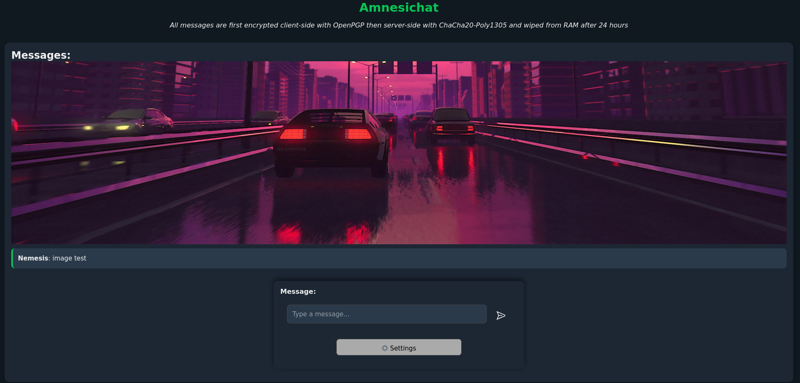
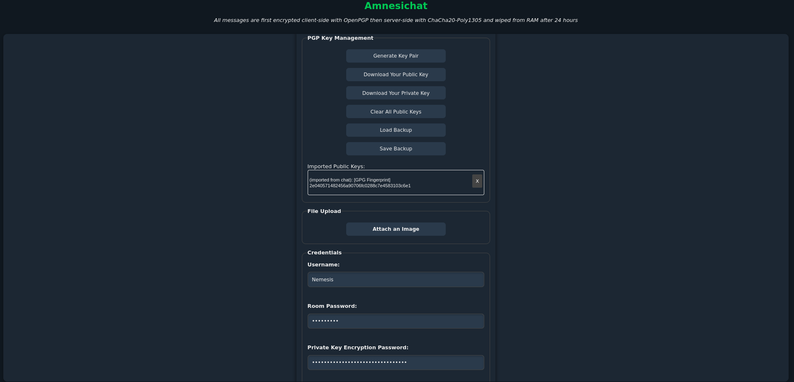
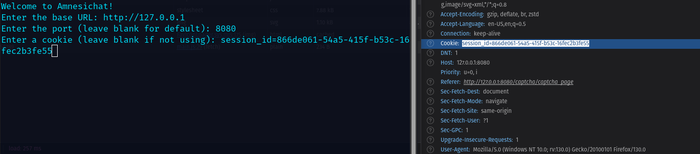

# Amnesichat


## An encrypted and anti-forensic web chat server
<!-- DESCRIPTION -->
## Description:

Amnesichat offers several key benefits, particularly in enhancing user privacy and security. By not retaining conversation histories or user data, it ensures that sensitive information shared during discussions remains confidential and is not accessible after the chat ends. This ephemeral nature fosters a safer environment for users to express their thoughts without fear of surveillance or data misuse.

## Warning: 

By using this service, you agree to the terms of service and acknowledge that you will not use it for illegal activities. The developer is not responsible for any misuse of the tool.

<!-- FEATURES -->
## Features:

- Client-side E2E message encryption

- Server-side room encryption

- Server runs even on cheapest hardware

- Each message is stored in RAM and wiped after 24 hours

- Docker support

- Written in Rust

## Technical details:

- OpenPGP using Ed25519 for client-side, ChaCha20-Poly1305 for server-side encryption
- Argon2id for key derivation

<!-- INSTALLATION -->
## Installation:

    sudo apt update
    sudo apt install curl build-essential git
    curl https://sh.rustup.rs -sSf | sh -s -- -y
    git clone https://github.com/umutcamliyurt/Amnesichat.git
    cd Amnesichat/
    cargo build --release
    cargo run --release


## Rust CLI Demo:
```
$ sudo apt update
$ sudo apt install -y libgpg-error-dev libgpgme-dev curl build-essential git
$ curl https://sh.rustup.rs -sSf | sh -s -- -y
$ cd Amnesichat/client/
$ cargo build --release
$ cargo run --release

Amnesichat
Please enter the server URL and port (e.g., http://localhost:8080):
http://localhost:8080
Enter your username:
user
Enter your room password:

Enter your private key password:

Enter your cookie (leave blank if none):

Your fingerprint(s):
1: 32f20b9b67f4b0b066e1cabaae7bde79bfd387b2
Enter your message or use commands(/exit, /generate_key_pair, /fingerprint): hey
user: hey
Available recipient fingerprint(s):
[1]: 73e7187c56ae2bc7b3bd55c42599d59fb16b5dc3
[2]: 3d46c4172efcb78a0a1370033a350651999492c2
[3]: e339af8e6950cc8aac3730459d1fd3ed7c9b5feb
Enter the numbers of the fingerprints to encrypt for, separated by commas (e.g., 1,3,5), 
or specify a range (e.g., 1-5). You can combine both formats (e.g., 1-3,5,7):
3
Checked for new messages.
Enter your message or use commands(/exit, /generate_key_pair, /fingerprint):

```

## Python CLI Demo:

```
$ sudo apt update
$ sudo apt install gnupg python3 python3-pip
$ git clone https://github.com/umutcamliyurt/Amnesichat.git
$ cd Amnesichat/
$ pip3 install -r requirements.txt
$ python3 client.py

Welcome to Amnesichat!
Enter the base URL: http://127.0.0.1
Enter the port (leave blank for default): 8080
Enter a cookie (leave blank if not using):

=== Initial Configuration ===
Enter your username: user
Do you want to generate a new PGP key pair? (y/n): n
Enter chatroom password: 
Enter private key encryption password: 
Enter path to private key file: user_privateKey.asc
Enter path to public key: user_publicKey.asc
Private key loaded successfully.
Loaded public key from Anonymous_public_key.asc and saved it to temp_keys/4a183360-aecd-4930-88cd-8ed7116465a2.asc
Enter your message (or /exit to quit): test
Available fingerprints of public keys:
1. 99330E7A54F518964C3F86CD7EEE25CDD0F14F40
2. 6A154BD5201944295A7E3B68B3D235E348535DB6
Choose public keys by entering the corresponding numbers separated by commas (1-2):
1,2
Message encrypted successfully for key 99330E7A54F518964C3F86CD7EEE25CDD0F14F40.
Message encrypted successfully for key 6A154BD5201944295A7E3B68B3D235E348535DB6.
Enter your message (or /exit to quit): 
```

## Run with Docker:
    
    sudo apt update
    sudo apt install docker.io git
    git clone https://github.com/umutcamliyurt/Amnesichat.git
    cd Amnesichat/
    sudo docker build -t amnesichat:latest .
    sudo docker run -p 8080:8080 amnesichat:latest

## Requirements:

- Any modern web browser or [Python](https://www.python.org/downloads/) for client
- [Rust](https://www.rust-lang.org) or [Docker](https://www.docker.com/) for server

<!-- SCREENSHOTS -->
## Screenshots:

*Image 1: Chat interface.*


*Image 2: Image upload feature.*


*Image 3: Settings.*


*Image 4: For accessing official server copy **session_id** cookie and paste it to CLI after completing Captcha.*

<!-- LICENSE -->
## License

Distributed under the MIT License. See `LICENSE` for more information.
