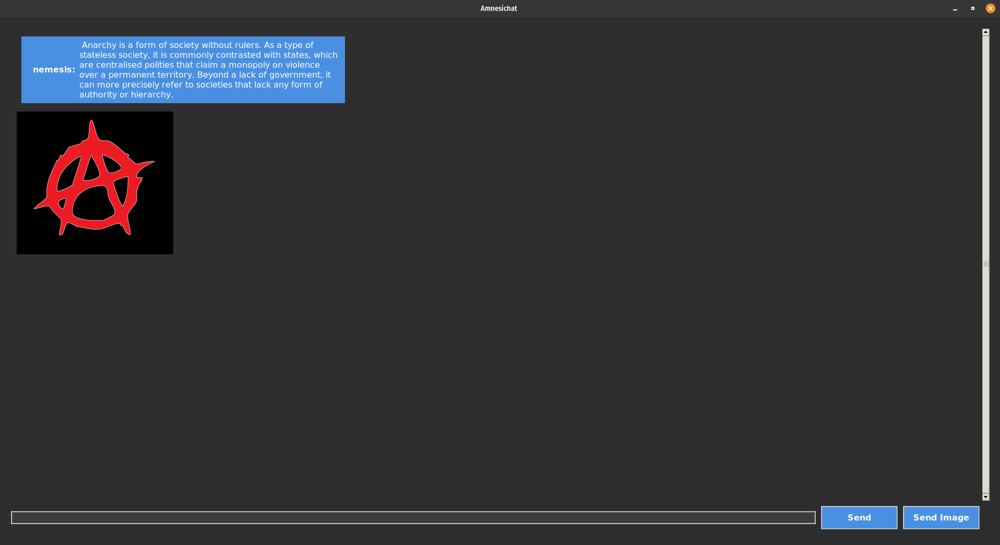

# Amnesichat


## A small, simple and secure messenger
<!-- DESCRIPTION -->
## Description:

Amnesichat offers several key benefits, particularly in enhancing user privacy and security. By not retaining conversation histories or user data, it ensures that sensitive information shared during discussions remains confidential and is not accessible after the chat ends. This ephemeral nature fosters a safer environment for users to express their thoughts without fear of surveillance or data misuse.

<!-- FEATURES -->
## Features:

- Client-side quantum-resistant E2E message encryption

- Forward and backward secrecy

- Server runs even on cheapest hardware

- Each message is stored encrypted in server's RAM and wiped after 24 hours

- Docker support

- Backend written in Rust

## Technical details:

- OpenPGP using Ed25519 for end-to-end encryption (v1)
- Amnesichat Protocol for end-to-end encryption (v2)
- Stores identity keys in local storage encrypted with ChaCha20-Poly1305 and Argon2id with an user specified password

### Amnesichat Protocol:
- EdDSA and Dilithium5 for authentication, ECDH and Kyber1024 for key exchange, encryption using ChaCha20-Poly1305

<!-- INSTALLATION -->
## Server setup:

    sudo apt update
    sudo apt install curl build-essential git
    curl https://sh.rustup.rs -sSf | sh -s -- -y
    git clone https://github.com/umutcamliyurt/Amnesichat.git
    cd Amnesichat/
    cargo build --release
    cargo run --release

## Run server with Docker:
    
    sudo apt update
    sudo apt install docker.io git
    git clone https://github.com/umutcamliyurt/Amnesichat.git
    cd Amnesichat/
    sudo docker build -t amnesichat:latest .
    sudo docker run -p 8080:8080 amnesichat:latest

## Client usage:
```
$ sudo apt update
$ git clone --depth=1 https://github.com/open-quantum-safe/liboqs-python
$ cd liboqs-python
$ sudo apt-get install python3 python3-pip cmake libssl-dev
$ pip3 install .
$ cd ..
$ git clone https://github.com/umutcamliyurt/Amnesichat.git
$ cd Amnesichat/
$ pip3 install -r requirements.txt
$ python3 client_v2_gui.py
```

## Requirements:

- Any modern web browser or [Python](https://www.python.org/downloads/) for client
- [Rust](https://www.rust-lang.org) or [Docker](https://www.docker.com/) for server

<!-- SCREENSHOT -->
## Screenshot:


<!-- LICENSE -->
## License

Distributed under the GPLv3 License. See `LICENSE` for more information.

## Donate to support development of this project!

**Monero(XMR):** 88a68f2oEPdiHiPTmCc3ap5CmXsPc33kXJoWVCZMPTgWFoAhhuicJLufdF1zcbaXhrL3sXaXcyjaTaTtcG1CskB4Jc9yyLV

**Bitcoin(BTC):** bc1qn42pv68l6erl7vsh3ay00z8j0qvg3jrg2fnqv9
